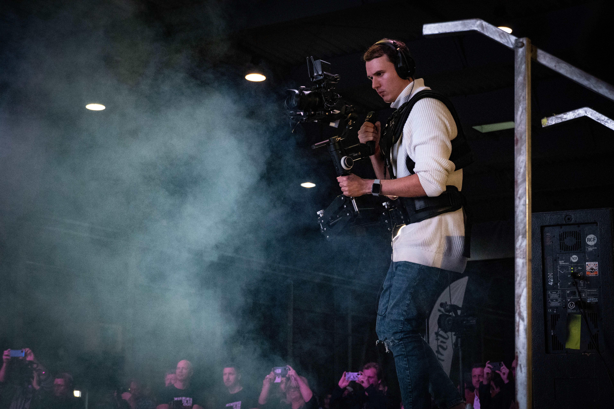

# Marek Červenka

## About me

 web developer, film maker, photographer and latin american dancer based in Prague.

- [My case study](docs/CONTRIBUTING.md)

## My story

Hi, my name is Marek and I live a little outside from Prague in a small village called Karlík. My goal has always been to do what I enjoy and fulfill. That's why I decided in elementary school that I could try IT. It was pretty clear because computers always pulled me. I did for a long time, but in high school, I only looked up in the second year, we had a website. I found myself here and stayed there. So I became a web developer. In my third year of high school, I also had a graphic design, where it caught me so much that I went to this school (VŠKK). And since I was a child, I have been very passionate about videos and photos, which have also become an integral part of my work.

In September 2020, together with Jiří Chyla, we founded a company called Gadzook. We said we would combine his graphics skills and my websites skills. In the end, it happened and we created a company that brings us joy and pride that we succeeded. We already do all possible industries. For example, visual identities, rebrands, websites, photos, videos, live streams, etc.
